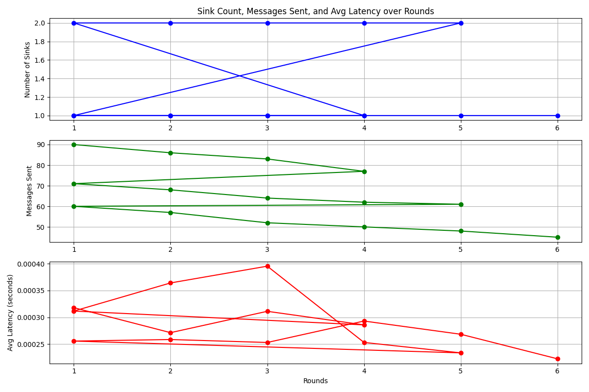

<p align="center">
	<a href="https://github.com/lukreitor"></a>
	<a href="https://github.com/lukreitor/sensor-network-simulation/releases"></a>
	<a href="https://github.com/lukreitor/sensor-network-simulation/releases"></a>
	<a href="https://github.com/lukreitor/sensor-network-simulation/LICENSE"></a>
	<a href="https://github.com/lukreitor/sensor-network-simulation/commits"></a>
	<a href="https://lukreitor.github.io/sensor-network-simulation"></a>
	<a href="https://github.com/lukreitor/sensor-network-simulation/stargazers"></a>
	<a href="https://github.com/lukreitor/sensor-network-simulation/network/members"></a>
	<a href="https://github.com/lukreitor/sensor-network-simulation/issues"></a>
	<a href="https://github.com/lukreitor/sensor-network-simulation/graphs/contributors"></a>
	<a href="https://github.com/lukreitor/sensor-network-simulation/graphs/traffic"></a>
</p>


# Simulação de Rede de Sensores

Este projeto simula uma rede de sensores dinâmica onde os nós podem atuar tanto como sensores quanto como destinos (sinks). O objetivo principal da simulação é garantir que os nós sensores possam enviar pacotes de dados para o destino mais próximo disponível, mesmo quando destinos são adicionados, removidos ou alterados dentro da rede. A simulação é projetada para rodar por 50 rodadas e se adaptar às mudanças na configuração da rede durante o processo.

## Visão Geral do Problema

A rede de sensores é configurada em uma grade bidimensional de 1000x1000, onde 100 nós sensores são distribuídos em um padrão de grade. Esses nós sensores enviam pacotes de dados para nós destinos designados, que recebem os pacotes. O desafio é que os nós destinos podem ser adicionados, removidos ou alterados, e a rede deve se adaptar para garantir que os nós sensores continuem enviando seus pacotes para o destino mais próximo.

A simulação ocorre em fases:
1. Inicialmente, apenas um nó é definido como destino, e todos os outros nós sensores enviam seus pacotes para esse destino.
2. Após 50 rodadas, outro destino é adicionado, e os nós sensores se ajustam para enviar dados ao mais próximo dos dois destinos.
3. Finalmente, o destino original é removido, e os nós sensores devem redirecionar seus pacotes para o destino restante.

O projeto fornece um relatório detalhado da simulação em formato Markdown, juntamente com gráficos de desempenho mostrando o número de mensagens enviadas e o número de destinos ativos durante a simulação.

## Recursos

- **Adaptação Dinâmica**: A simulação se adapta à adição, remoção e alteração de destinos em tempo real.
- **Geração Automática de Resultados**: Um relatório em Markdown e gráficos de desempenho são gerados automaticamente ao final da simulação.
- **Escalabilidade**: A simulação é capaz de rodar por mais rodadas e pode ser expandida para acomodar mais nós e destinos.

## Instalação

### Requisitos

- Python 3.x
- Bibliotecas necessárias: `matplotlib`, `numpy`

Você pode instalar as bibliotecas necessárias usando pip:

```bash
pip install matplotlib numpy
```

## Explicação Detalhada do Problema

O problema proposto consiste em simular uma rede de sensores que envolve múltiplos nós sensores distribuídos em uma área bidimensional de 1000x1000 unidades. Esses nós desempenham duas funções: atuam como sensores, capturando dados e enviando pacotes para outros nós, e podem ser configurados como "sinks", responsáveis por receber esses pacotes de dados.

A complexidade do problema reside no fato de que, durante a simulação, os nós sinks podem ser adicionados, removidos ou alterados, e a rede deve se ajustar dinamicamente para garantir que os nós sensores continuem enviando pacotes para os sinks disponíveis mais próximos. A comunicação entre os nós deve ser eficiente e dinâmica, considerando as alterações dos sinks no decorrer do tempo. O objetivo principal é testar a resiliência e adaptabilidade dos nós sensores em condições variáveis, sem utilizar a função `sendDirect`, o que adiciona um nível de desafio à implementação.

## O que Foi Implementado

1. **Modelo de Distribuição dos Nós Sensores**  
   A rede foi configurada utilizando uma abordagem de distribuição em grade (Grid2D), onde os 100 nós sensores foram distribuídos uniformemente na área de 1000x1000 unidades. Isso permite garantir uma estrutura organizada e facilita o cálculo da distância entre os nós, essencial para determinar o nó sink mais próximo.

2. **Função de Sink**  
   Inicialmente, apenas um nó é designado como sink. Este nó recebe os pacotes enviados pelos outros nós sensores. Com o passar dos rounds, um segundo nó é designado como sink, e a rede deve adaptar-se a essa nova configuração, redirecionando os pacotes para o sink mais próximo.

3. **Simulação de Rounds**  
   A simulação foi executada em três fases, com cada fase composta de 50 rounds:
   - **Fase 1**: O primeiro nó é designado como sink, e a rede opera com esse único sink por 50 rounds.
   - **Fase 2**: Um segundo sink é adicionado no nó de ID 50, e a rede se adapta para considerar os dois sinks.
   - **Fase 3**: O primeiro sink é removido, deixando apenas o segundo sink como receptor de pacotes. A rede se ajusta novamente para enviar os pacotes exclusivamente para esse sink.

4. **Coleta e Exibição dos Resultados**  
   Durante cada round, foi coletado o número de mensagens enviadas e o número de sinks ativos. Esses dados foram então processados para gerar um relatório em formato Markdown e gráficos visuais, mostrando a evolução do comportamento da rede ao longo do tempo.

5. **Geração Automática de Relatório**  
   Um arquivo Markdown (`sensor_simulation_report.md`) é gerado automaticamente ao fim da simulação. Este arquivo contém uma tabela com os resultados coletados em cada round, incluindo o número de sinks e o número de mensagens enviadas.

6. **Plotagem de Gráficos**  
   Para complementar o relatório, gráficos são gerados e salvos automaticamente. Eles ilustram:
   - O número de sinks ativos ao longo dos rounds.
   - O número de mensagens enviadas pelos nós sensores em cada round.

## Análise dos Resultados

Os gráficos e a tabela gerados pela simulação oferecem uma visão clara do comportamento da rede de sensores ao longo dos 50 rounds.

### 1. **Número de Sinks Ativos**
   Durante os primeiros 50 rounds, o gráfico mostra apenas um sink ativo, pois o sistema inicia com um único destino para os pacotes. A partir do round 51, um segundo sink é adicionado, e o gráfico reflete essa alteração com o aumento no número de sinks ativos. Isso é crucial para observar como a rede reage e redistribui os pacotes com a adição de novos destinos. Finalmente, quando o sink original é removido, o gráfico demonstra a adaptação da rede para operar com apenas um sink novamente.

### 2. **Número de Mensagens Enviadas**
   O gráfico que mostra o número de mensagens enviadas reflete a dinâmica da rede e sua eficiência em transmitir dados. Nas primeiras 50 rodadas, a quantidade de mensagens enviadas mantém um padrão estável, pois há apenas um destino. Quando o segundo sink é adicionado, observa-se um aumento na eficiência, com os nós sensores redirecionando suas mensagens para o sink mais próximo, o que reduz a carga no sink inicial. Com a remoção do primeiro sink, os nós restantes ajustam-se ao novo cenário, mantendo uma taxa constante de envio de mensagens.

Esses resultados mostram que a rede de sensores é capaz de se adaptar eficientemente a mudanças na configuração dos sinks, mantendo uma alta taxa de entrega de pacotes e um bom equilíbrio na utilização dos recursos disponíveis.

### Gráfico de Desempenho



## Conclusão

O trabalho implementado simula com sucesso uma rede de sensores dinâmica que se adapta às mudanças na configuração dos sinks, garantindo que os nós sensores enviem pacotes para o sink mais próximo, mesmo após alterações no cenário. A documentação e os gráficos gerados oferecem uma visão clara do comportamento da rede ao longo dos rounds, permitindo a análise de eficiência e resiliência do sistema implementado.

### Sugestões Finais

Este projeto pode ser estendido para incluir mais complexidade, como múltiplos tipos de pacotes de dados, diferentes estratégias de roteamento, ou até simulações mais longas com maiores números de nós sensores e sinks. Isso permitiria testar a escalabilidade e robustez do sistema em cenários mais realistas e desafiadores.

---


## Contributors ✨

<table>
	<tr>
		<th align="center">
				<a href="https://github.com/lukreitor">
					<sub><b>Lucas Martins da Silva Sena</b></sub>
				</a>
		</th>
  	</tr>
 	<tr>
		<td align="center">
			<a href="https://github.com/lukreitor">
				
			</a>
		</td>
	</tr>
</table>


**Please contact me using one of the following:**

[](https://twitter.com/lukreitor) 
[](https://www.linkedin.com/in/lucasmartins-2001-2018/) 
[](https://www.instagram.com/lucas15_m.s/) 
[](https://t.me/lukreitor/) 
[](https://www.facebook.com/profile.php?id=100008448453915) 
[](https://dev.to/username)  

<p align="center">  
<hr>Developed with ❤️ in Brazil 🇧🇷 
</p>
